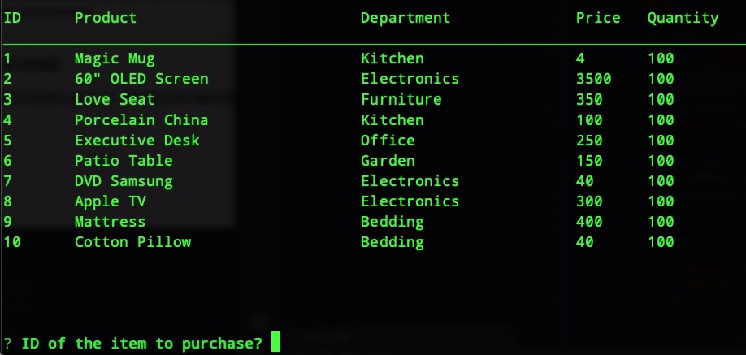

# Node.js & MySQL

This applicacion is a basic amazon like store, where it shows all the products in the database and lets you buy them and update the stock as it changes. 

Requeres a Mysql database with the attached table structure.


A video of the working app link is here: 
[Video](https://youtu.be/oQrM7uoP4m4)

##Screenshoot
> 


###Mysql Table Structure
````
DROP TABLE IF EXISTS `products`;
CREATE TABLE `products` 
( 
`item_id` int(11) NOT NULL AUTO_INCREMENT,
`product_name` varchar(100) DEFAULT NULL,
`department_name` varchar(50) DEFAULT NULL,
`price` decimal(10,2) DEFAULT NULL, 
`stock_quantity` int(11) DEFAULT NULL, PRIMARY KEY (`item_id`) 
) 
ENGINE=InnoDB AUTO_INCREMENT=11 DEFAULT CHARSET=utf8;
LOCK TABLES `products` WRITE;
/*!40000 ALTER TABLE `products` DISABLE KEYS */;
INSERT INTO 
`products` VALUES 
(1,'Mug','Kitchen',4.00,400),
(2,'60\" OLED Screen','Electronics',3500.00,10),
(3,'Love Seat','Furniture',350.00,5),
(4,'Porcelain China','Kitchen',100.00,20),
(5,'Executive Desk','Office',250.00,10),
(6,'Patio Table with Chairs','Garden',150.00,5),
(7,'DVD','Electronics',40.00,50),
(8,'Apple TV','Electronics',300.00,60),
(9,'Mattress','Bedding',400.00,20),
(10,'Pillow','Bedding',40.00,100);
/*!40000 ALTER TABLE `products` ENABLE KEYS */; UNLOCK TABLES; 
````